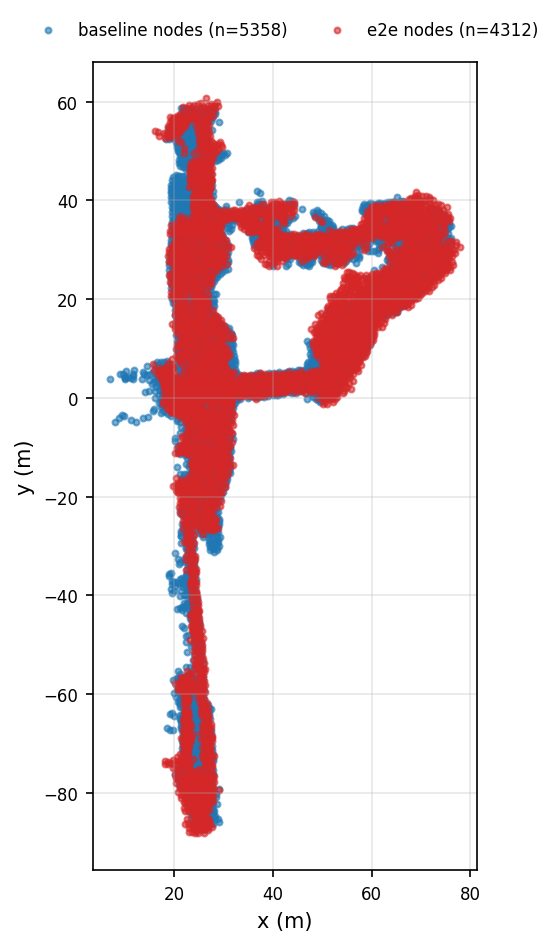
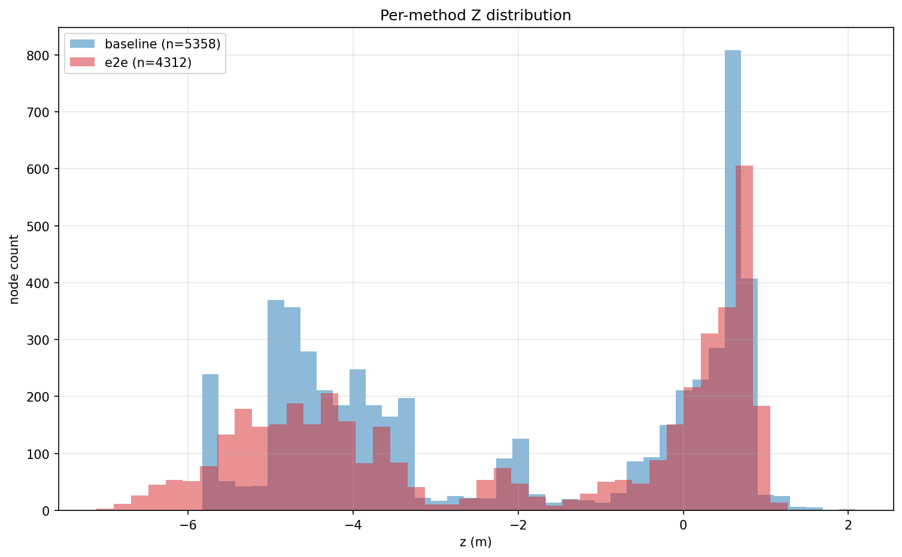
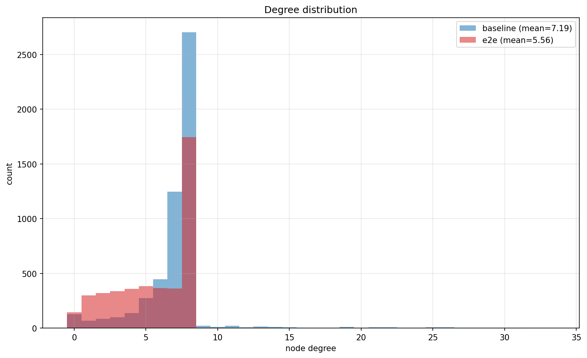
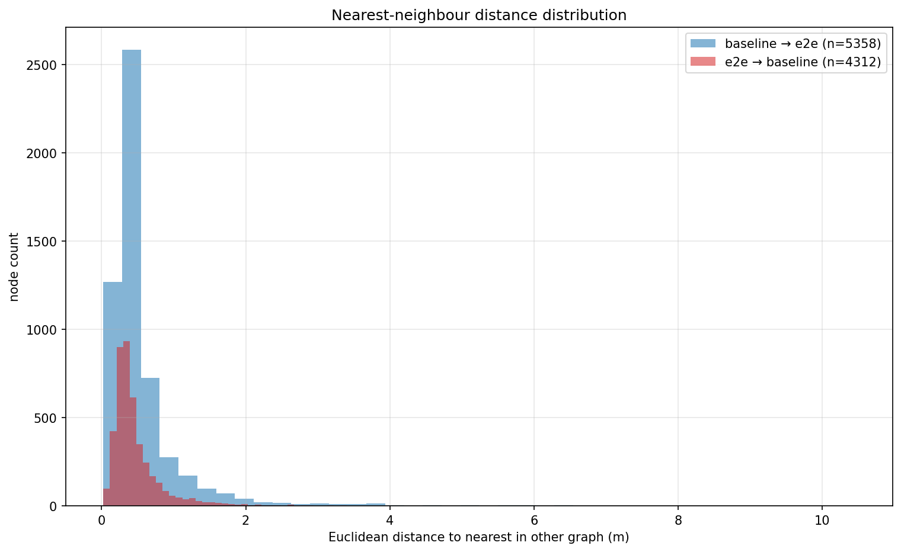
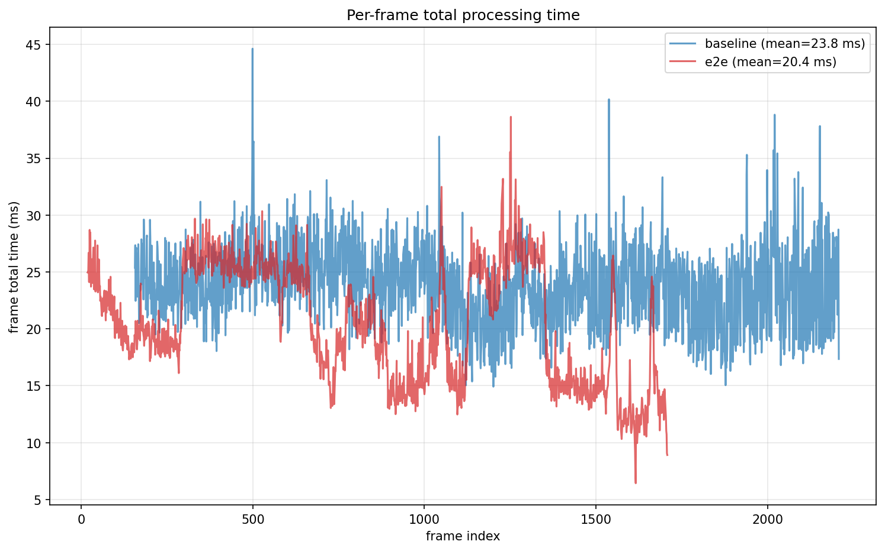
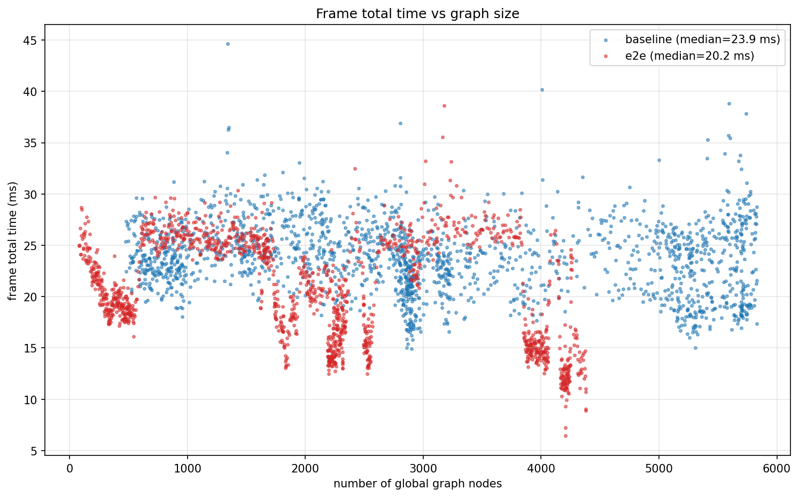
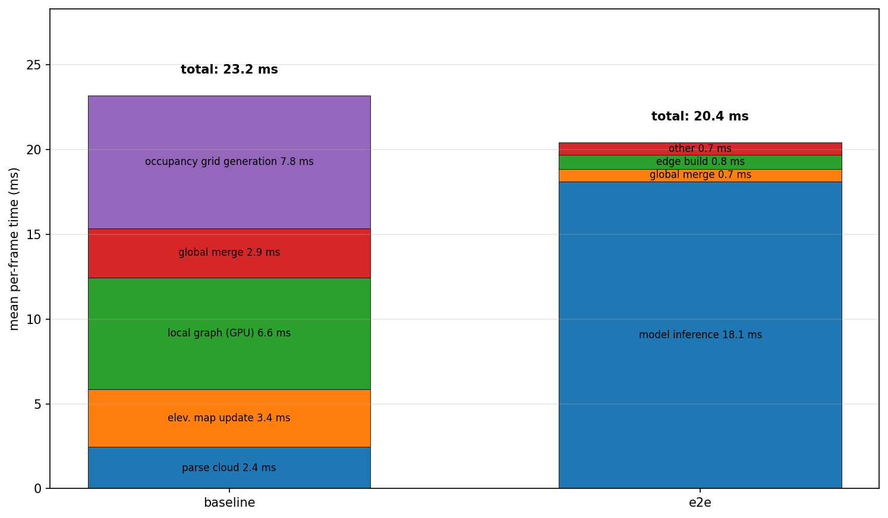
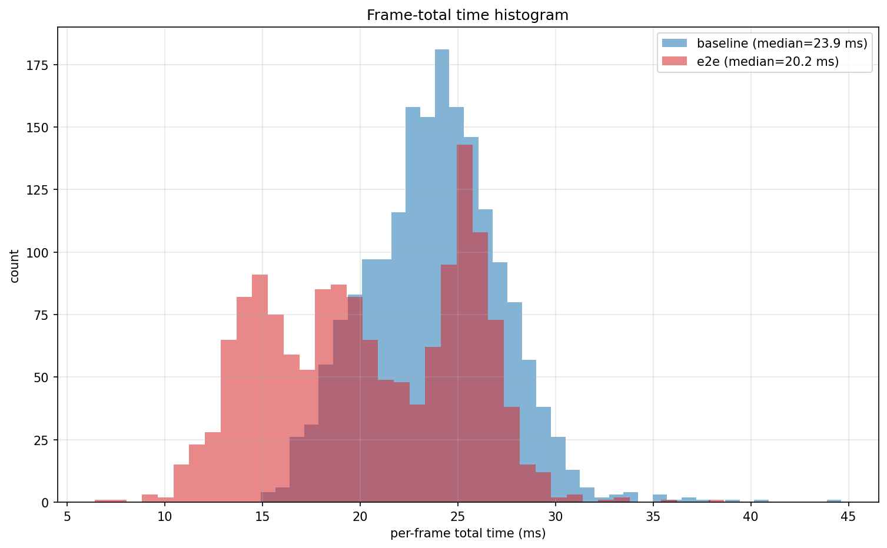
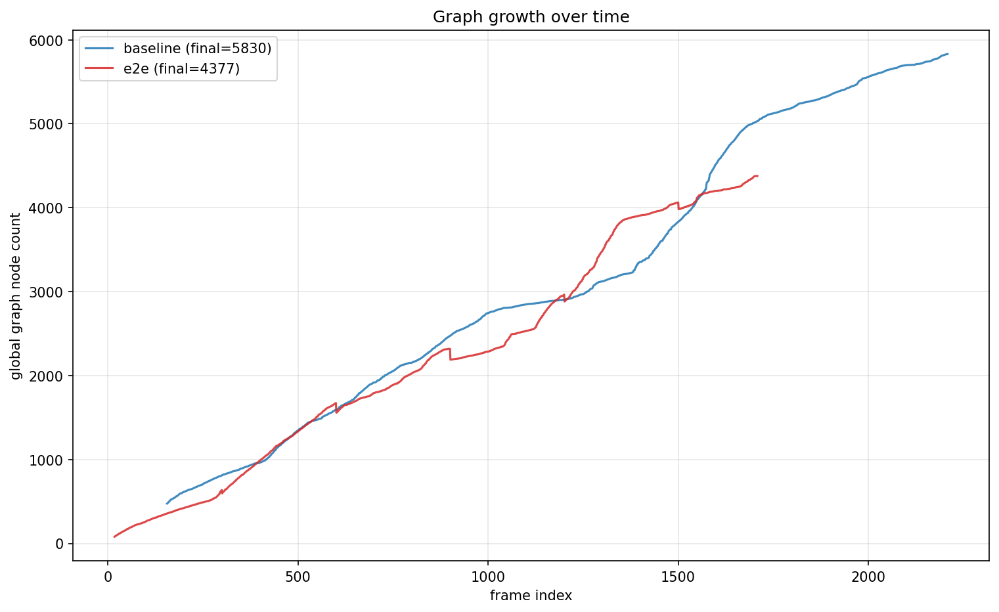

# nav-graph comparison report

## Sources

- **baseline** — `/home/rohang73/Documents/odin_e2e/graph_compaRISION/inputs/nav_graph_node.json` (saved 2026-05-21T12:42:04.143392+00:00, 5358 nodes, 19262 edges, frame_count=2208)
- **e2e** — `/home/rohang73/Documents/odin_e2e/graph_compaRISION/inputs/nav_graph_node_e2e.json` (saved 2026-05-21T14:13:45.388447+00:00, 4312 nodes, 11994 edges, frame_count=1709)

> **Note:** the first **15.0 s** of each timing CSV (measured against that CSV's own first `frame_timestamp_sec`) were dropped before any plot / mean / median was computed — covers the e2e JIT-warmup spike.  The same filter is propagated to the graph snapshots: every node whose ID was assigned during the warmup window is also excluded from the XY overlay, structural metrics, planning queries, and nearest-neighbour comparisons.

## Summary table

| metric | baseline | e2e | delta (e2e − baseline) |
|---|---:|---:|---:|
| num_nodes | 5358.000 | 4312.000 | -1046.000 |
| num_edges | 19262.000 | 11994.000 | -7268.000 |
| num_free | 5186.000 | 4312.000 | -874.000 |
| num_frontier | 172.000 | 0.000 | -172.000 |
| frame_count | 2208.000 | 1709.000 | -499.000 |
| bbox_x | 69.000 | 62.011 | -6.989 |
| bbox_y | 146.300 | 148.856 | 2.556 |
| bbox_z | 7.915 | 8.372 | 0.457 |
| xy_area_m2 | 10094.659 | 9230.656 | -864.003 |
| xy_density_per_m2 | 0.531 | 0.467 | -0.064 |
| z_mean | -2.138 | -2.092 | 0.046 |
| z_std | 2.394 | 2.561 | 0.167 |
| mean_nn_distance_m | 0.538 | 0.577 | 0.038 |
| median_nn_distance_m | 0.510 | 0.553 | 0.043 |
| avg_degree | 7.190 | 5.563 | -1.627 |
| mean_edge_len_m | 0.800 | 1.050 | 0.250 |
| max_edge_len_m | 2.000 | 2.406 | 0.406 |
| num_cc | 146.000 | 166.000 | 20.000 |
| largest_cc_size | 5153.000 | 2328.000 | -2825.000 |
| largest_cc_frac | 0.962 | 0.540 | -0.422 |
| planning_success_rate | 0.905 | 0.465 | -0.440 |
| planning_mean_path_length_m | 66.799 | 42.006 | -24.793 |
| planning_median_path_length_m | 58.573 | 40.061 | -18.512 |
| planning_mean_snap_distance_m | 0.131 | 0.211 | 0.080 |
| planning_n_pairs | 200.000 | 200.000 | 0.000 |
| mean_t_parse_ms | 2.449 | NaN | NaN |
| mean_t_emap_ms | 3.396 | NaN | NaN |
| mean_t_local_ms | 6.600 | NaN | NaN |
| mean_t_merge_ms | 2.907 | 0.737 | -2.169 |
| mean_t_other_ms | 7.843 | 0.733 | -7.110 |
| mean_t_graph_total_ms | 17.349 | NaN | NaN |
| mean_t_frame_total_ms | 23.826 | 20.416 | -3.410 |
| mean_t_inference_ms | NaN | 18.119 | NaN |
| mean_t_edges_ms | NaN | 0.826 | NaN |
| chamfer_distance_3d_m | 0.520 |  |  |
| hausdorff_distance_3d_m | 10.454 |  |  |
| bbox_iou_2d | 0.839 |  |  |
| occupancy_iou_2d | 0.345 |  |  |
| node_density_correlation | 0.446 |  |  |

## Plots

Each plot is saved as a PDF (canonical, vector) **and** as a PNG twin so the markdown preview can render it inline.  Click any PDF link to open the print-quality version.

### xy_overlay

_[Open as PDF](plots/xy_overlay.pdf)_

### z_histograms

_[Open as PDF](plots/z_histograms.pdf)_

### degree_histograms

_[Open as PDF](plots/degree_histograms.pdf)_

### nn_distance_histograms

_[Open as PDF](plots/nn_distance_histograms.pdf)_

### timing_per_frame

_[Open as PDF](plots/timing_per_frame.pdf)_

### timing_vs_nodes

_[Open as PDF](plots/timing_vs_nodes.pdf)_

### timing_breakdown

_[Open as PDF](plots/timing_breakdown.pdf)_

### timing_histograms

_[Open as PDF](plots/timing_histograms.pdf)_

### graph_growth

_[Open as PDF](plots/graph_growth.pdf)_

## Interpretation hints

- **mean_nn_distance_m / median_nn_distance_m** — average and median distance from each node to its nearest neighbour in 3-D ("node density" proxy).  Lower ⇒ denser graph.  Independent of the map extent, so the two methods compare fairly even when they cover slightly different regions.
- **Chamfer / Hausdorff** measure how spatially close the two node sets are.  Lower = more similar spatial coverage.  Chamfer is the mean of the two-way nearest-neighbour means; Hausdorff is the worst nearest-neighbour distance — sensitive to outliers.
- **Bbox / occupancy / density correlation** describe extent and distribution agreement.  Occupancy IoU close to 1.0 ⇒ both graphs cover the same XY region at the chosen cell size.
- **Planning success rate** is the apples-to-apples quality proxy: random world-locations are projected to each graph, then Dijkstra checks whether a path exists.  Equal or higher e2e success rate at comparable mean-path-length argues parity; higher mean-path-length is suspicious (detours).
- **Timing breakdown** is mean per-step time over the whole run. Stacks are not directly comparable beyond their totals because the two methods have different sub-steps — but the total height is.  Watch the *vs. node count* scatter for scaling behaviour.
